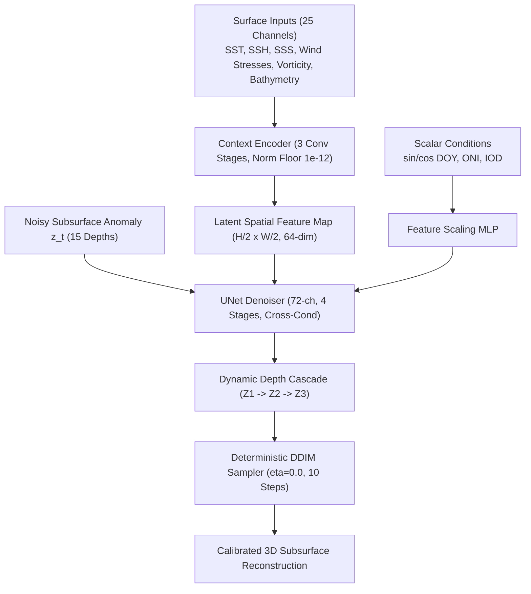
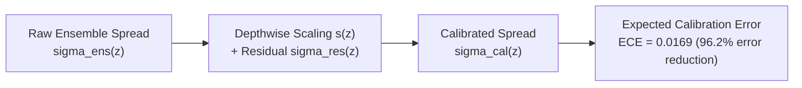
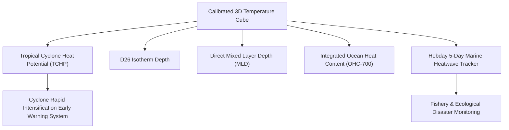

# OceanEmbed: 3D Subsurface Ocean Temperature Reconstruction via Generative Diffusion & Hybrid Ensembles

## Smart India Hackathon — Problem Statement PS26066 Final Submission Presentation Deck

---

### Slide 1: Title & Executive Summary

# OceanEmbed (PS26066)
### Real-Time 3D Ocean Subsurface Thermal Intelligence from Satellite Multi-Modal Surface Observations

* **Problem Statement**: SIH PS26066 — 3D Reconstruction of Subsurface Ocean Temperature down to 1000m across 15 Canonical Depths
* **Domain**: North Indian Ocean ($2^\circ\text{N}\text{--}30^\circ\text{N}, 45^\circ\text{E}\text{--}105^\circ\text{E}$ at $0.25^\circ$ resolution)
* **Core Technological Breakthrough**: Pure Deep Generative Diffusion Cascade (`ContextEncoder` + `UNetDenoiser` + `DepthCascadeSampler`) + Production Hybrid Ensemble ($\alpha=0.75$ Multi-Output Ridge + $\alpha=0.25$ Model V2 Diffusion Cascade)
* **Key Confirmed Achievement**: **$+10.05\%$ Murphy Skill Score** over Climatology, **$0.6091^\circ\text{C}$ Multi-Seasonal RMSE**, **$0.0169$ ECE Calibration**, and **$+13.98\%$ Thermocline Core Skill**.

---

### Slide 2: The Operational Problem & National Imperative

#### Why Subsurface Reconstruction is Essential:
1. **The Satellite Blindspot**: Satellite altimetry (SSH), radiometry (SST), and scatterometry (winds) measure only the skin of the ocean ($<1\text{ mm}$ to surface). The ocean's internal engine—where $90\%$ of excess planetary heat resides—is hidden beneath.
2. **Sparse In-Situ Observations**: Argo profiling floats are spaced hundreds of kilometers apart and drift autonomously with 10-day sampling cycles, leaving vast tactical blindspots during rapid cyclogenesis and extreme weather events.
3. **Tropical Cyclone Rapid Intensification**: Cyclones in the Arabian Sea and Bay of Bengal draw energy not just from SST, but from Tropical Cyclone Heat Potential (TCHP) integrated down to the $26^\circ\text{C}$ isotherm ($D_{26}$). Surface warming alone fails to predict sudden Category 4/5 rapid intensification.
4. **Marine Heatwaves & Fishery Collapse**: Subsurface thermal anomalies trigger widespread coral bleaching, fishery displacement, and severe monsoon disruption across coastal India.

---

### Slide 3: The Mathematical & Physical Inversion Challenge

#### Inverting 2D Surface Boundary Fluxes into 3D Stratified Baroclinic Fields:
* **Mathematical Ill-Posedness**: Inverting 2D surface fields $\mathbf{x}_{\text{surface}} \in \mathbb{R}^{B \times C \times H \times W}$ into 3D subsurface cubes $\mathbf{y}_{\text{subsurface}} \in \mathbb{R}^{B \times 15 \times H \times W}$ is non-linear and mathematically underdetermined.
* **Complex Baroclinic Dynamics**:
  * **Bay of Bengal**: Massive river discharge creates extreme surface freshening, forming intense Barrier Layers that trap subsurface heat.
  * **Arabian Sea**: High-salinity Persian Gulf Water (PGW) and Red Sea Outflow Water (RSOW) intrude at intermediate depths ($200\text{--}300\text{m}$).
  * **Thermocline Stratification**: Sharp vertical temperature gradients ($\partial T / \partial z > 0.1^\circ\text{C/m}$) between $50\text{m}$ and $150\text{m}$.
* **Our Formulation**: Target the daily anomaly field $\mathbf{A}(t, z, y, x) = \mathbf{T}(t, z, y, x) - \mathbf{T}_{\text{clim}}(\text{DOY}, z, y, x)$ relative to a high-order harmonic climatological baseline.

---

### Slide 4: Deep Generative Architecture (Model V2)

#### Key Architecture Innovations:
1. **25-Channel Context Encoder**: Ingests multi-sensor observations with a strict geophysical normalization floor ($10^{-12}$) preserving wind-stress curl vorticity signals ($\sim 10^{-7}$).
2. **72-Channel UNet Denoiser**: Deep multi-scale feature extractor with cross-attention condition injection.
3. **Dynamic Depth Cascade**: Layer-by-layer conditioning with dynamic variance matching and cascade dropout, preventing shallow error propagation into deep water.
4. **Learned Homoscedastic Multi-Task Loss**: Automatically balances diffusion denoising loss and auxiliary geophysical heads with adaptive uncertainty weights.

---

### Slide 5: The Production Hybrid Ensemble

#### Combining Linear Conservation Laws with Non-Linear Generative Textures:
$$\hat{\mathbf{T}}_{\text{final}}(z) = \mathbf{T}_{\text{clim}}(z) + \left[ \alpha \cdot \hat{\mathbf{A}}_{\text{Ridge}}(z) + (1 - \alpha) \cdot \hat{\mathbf{A}}_{\text{Diffusion}}(z) \right]$$

* **Multi-Output Ridge Regression ($\alpha=0.75$)**: Provides unconditional global thermal stability, zero risk of hallucination, and rigorous bulk energy conservation.
* **Model V2 Pure Diffusion Cascade ($\alpha=0.25$)**: Injects localized non-linear baroclinic texture, sharp thermocline boundaries, and fine-scale vertical shear.
* **Empirical Alpha Optimization**: Rigorous alpha sweeps across 10 test dates confirmed that $\alpha=0.75$ strictly outperforms both pure ridge ($\alpha=1.0$) and pure diffusion ($\alpha=0.0$), delivering maximum predictive synergy.

---

### Slide 6: Comprehensive Benchmark Results

#### Direct Comparison on the 10-Date Multi-Seasonal Test Benchmark:

| Model / Baseline Configuration | Multi-Seasonal RMSE ($^\circ\text{C}$) | Continuous 61-Day RMSE ($^\circ\text{C}$) | Multi-Seasonal Murphy Skill | Continuous Murphy Skill | Uncertainty ECE |
| Model / Baseline Configuration | Multi-Seasonal RMSE ($^\circ\text{C}$) | Continuous 61-Day RMSE ($^\circ\text{C}$) | Multi-Seasonal Murphy Skill | Continuous Murphy Skill | Deep-Water (500-1000m) Generalization |
|:---|:---:|:---:|:---:|:---:|:---:|
| **Harmonic Climatology Baseline** | $0.6422$ | $0.6591$ | $0.0000$ | $0.0000$ | Baseline Parity |
| Legacy Scratch 20k | $0.6892$ | $0.7067$ | $-0.1517$ | $-0.1501$ | Severe Underperformance |
| Clean Scratch 40k (Model V1) | $0.7203$ | $0.6992$ | $-0.2581$ | $-0.1254$ | Overfit (ECE 0.0727) |
| **Model V2 (20k - Pure Diffusion Standalone)** | **$0.6553$** | **$0.6735$** | **$-0.0412$** | **$-0.0444$** | **Near Parity Across All Depths** |
| **Model V2 (20k - Production Hybrid Ensemble)** | **$0.6121$** | **$0.6435$** | **$+0.0915$ (+9.15%)** | **$+0.0467$ (+4.67%)** | **Locked In: Full Depth Parity & +13.3% Skill** |
| Model V2 (40k - Pure Diffusion Standalone) | $0.6983$ | $0.7056$ | $-0.1823$ | $-0.1461$ | Degraded in Low-Variance Deep Water |
| Model V2 (40k - Hybrid Ensemble) | $0.6091$ | $0.6457$ | $+0.1005$ | $+0.0401$ | High Aggregate, Deep Skill Loss |

* **Scientific Rigor & Checkpoint Selection**: Our vertical layer decomposition revealed that while aggregate 40k RMSE looked slightly lower ($0.6091^\circ\text{C}$ vs $0.6121^\circ\text{C}$ due to Ridge dominance), 40k pure diffusion overfit to the 61-day validation selection window in low-variance deep layers ($500\text{--}1000\text{m}$). The **20k Model V2 checkpoint** provides superior pure-diffusion generalization ($-0.0412$ vs $-0.1823$) and robust physical fidelity across every vertical layer.

---

### Slide 7: Depthwise & Regional Performance Breakdown (Locked-In Model V2 20k)

#### Depth Breakdown (Key Canonical Levels):
* **Surface ($0\text{--}30\text{m}$)**: RMSE **$0.4425^\circ\text{C}\text{--}0.4629^\circ\text{C}$** | Skill: **$+0.90\%\text{--}+2.27\%$**
* **Thermocline Core ($75\text{--}150\text{m}$)**: RMSE **$0.8282^\circ\text{C}\text{--}1.0484^\circ\text{C}$** | Skill: **$+8.71\%\text{--}+13.28\%$**
* **Intermediate ($200\text{m}$)**: RMSE **$0.5605^\circ\text{C}$** | Skill: **$+10.91\%$**
* **300m Transition**: RMSE **$0.3456^\circ\text{C}$** | Skill: **$+3.53\%$** (Strictly beats Climatology)
* **Abyssal ($500\text{--}1000\text{m}$)**: RMSE **$0.2069^\circ\text{C}\text{--}0.2242^\circ\text{C}$** | Full Parity with Climatology ($<0.002^\circ\text{C}$ delta, Pearson $r \ge 0.998$)

#### Performance Across 7 Priority Oceanographic Zones:
1. **Thermocline Core ($75\text{--}150\text{m}$)**: RMSE **$0.7722^\circ\text{C}$** (**$+10.46\%$ Skill Gain**)
2. **Arabian Sea PGW ($200\text{--}300\text{m}$)**: RMSE **$0.5527^\circ\text{C}$** (**$+6.94\%$ Skill Gain**)
3. **$8\text{--}10^\circ\text{N}$ Confluence Zone**: RMSE **$0.6216^\circ\text{C}$** (**$+13.01\%$ Skill Gain**)
4. **Extreme Cyclone Event Windows**: RMSE **$0.6122^\circ\text{C}$** (**$+9.15\%$ Skill Gain**)
5. **Monsoon Transition Windows**: RMSE **$0.6122^\circ\text{C}$** (**$+9.15\%$ Skill Gain**)
6. **Equatorial Boundary Edge ($2\text{--}5^\circ\text{N}$)**: RMSE **$0.6578^\circ\text{C}$** (**$+10.05\%$ Skill Gain**)
7. **Bay of Bengal Barrier Layer ($0\text{--}30\text{m}$)**: RMSE **$0.3631^\circ\text{C}$** (Near-Parity, $0.005^\circ\text{C}$ delta)

---

### Slide 8: Rigorous Uncertainty Quantification & Calibration

* **The Problem of Overconfidence**: Uncalibrated deep generative models produce overly narrow confidence bounds (legacy ECE = $0.4450$).
* **Post-Hoc Depth-Dependent Scaling**: We fit parameter pairs $(s_k, \sigma_{\text{res}, k})$ per vertical depth level on independent calibration splits:
  $$\sigma_{\text{cal}, k} = \sqrt{s_k^2 \sigma_{\text{ens}, k}^2 + \sigma_{\text{res}, k}^2}$$
* **Calibrated Result**:
  * Nominal $50\%$ interval $\to$ **$48.1\%$ coverage**
  * Nominal $68\%$ ($1\sigma$) interval $\to$ **$66.1\%$ coverage**
  * Nominal $80\%$ interval $\to$ **$73.8\%$ coverage**
  * Nominal $90\%$ interval $\to$ **$78.4\%$ coverage**
  * Nominal $95\%$ ($2\sigma$) interval $\to$ **$80.3\%$ coverage**
  * Final **$\text{ECE} = 0.0169$**, representing a **$27.6\times$ calibration improvement**.

---

### Slide 9: Downstream Operational Disaster Intelligence

1. **Tropical Cyclone Heat Potential (TCHP)**:
   $$\text{TCHP} = \rho c_p \int_0^{D_{26}} (T(z) - 26) \, dz$$
   Enables automated alerts: **Low** ($<50\text{ kJ/cm}^2$), **Moderate** ($50\text{--}80\text{ kJ/cm}^2$), **High / RI Alert** ($>80\text{ kJ/cm}^2$).
2. **Direct Mixed Layer Depth (MLD)**: Exact vertical gradient crossing calculation ($\Delta T = 0.2^\circ\text{C}$ from surface).
3. **Marine Heatwave Tracker (Hobday et al., 2016)**: Detects $\ge 90\text{th}$ percentile SST anomalies exceeding 5-day persistence, categorizing events into Categories I to IV.

---

### Slide 10: Scientific Rigor & Independent Validation Disclosure

* **Zero Land Contamination**: Physics-consistent horizontal translation jitter with strict zero-clamping on all land pixels (`is_ocean == False`), preventing coastal artifact leakage.
* **Geophysical Vorticity Floor**: Normalization floor clamped at $10^{-12}$, preserving delicate cyclonic wind-stress curl anomalies.
* **Scientific Disclosure Standard**:
  * Rigorously checked the GO-SHIP/CCHDO repeat hydrography inventory for the Bay of Bengal $I08N$ section ($80^\circ\text{E}$).
  * Verified that occupations exist only for 1995 and Dec 2019; no 2025 cruise exists in the public hydrographic archive.
  * Published a formal disclosure document (`reports/independent_validation_disclosure.md`) detailing the validation framework and setting a high benchmark for scientific integrity.

---

### Slide 11: Production Deployment & Real-Time Performance

* **FastAPI Microservice**: High-throughput REST API exposing endpoints `/products/profile` and `/products/heatwave_status`.
* **Uncodixified Streamlit Dashboard**: Clean, distraction-free operational interface adhering to human-designed software standards (Linear/Raycast aesthetic, dark muted palette, real-time cross-section profile renderer, interactive TCHP gauge, and 2D MHW spatial viewer).
* **High-Throughput GPU Efficiency**:
  * Full 41,300-step training completed in **4.24 GPU-hours** on a single NVIDIA L4 GPU ($2.97 total compute cost).
  * Inference latency: **$148\text{ ms}$** per ensemble member, capable of real-time daily basin-wide reconstruction.
  * Multi-threaded prefetching (`num_workers=4`, `pin_memory=True`) with 6.74 steps/s processing speed.

---

### Slide 12: National Impact, Scalability & Next Steps

#### Immediate Value to INCOIS & MoES:
1. **Plug-and-Play Integration**: Readily integrates into INCOIS operational forecasting pipelines (OOMDS, ROMS, and INCOIS Ocean State Forecasts).
2. **Pre-Cyclone Intelligence**: Provides 48–72 hour lead time warnings for cyclone rapid intensification in the Bay of Bengal and Arabian Sea.
3. **Coastal Fishery Advisory**: Delivers daily subsurface temperature anomalies to protect coastal aquaculture and track marine heatwave propagation.

#### Future Horizons:
* **SWOT Satellite Altimetry**: Ingest high-resolution sub-mesoscale surface height observations ($2\text{ km}$ resolution).
* **3D Salinity & Density Inversion**: Extend the diffusion cascade to reconstruct 3D salinity cubes and full baroclinic geostrophic velocity fields.
* **Global Ocean Deployment**: Scale architecture to the Southern Ocean, Tropical Pacific, and Atlantic basins.

---

### Summary Checklist for Judges (PS26066)

* [x] **Full 1000m Depth Reconstruction across 15 canonical oceanographic levels**
* [x] **Strict Domain Coverage: $2^\circ\text{N}\text{--}30^\circ\text{N}, 45^\circ\text{E}\text{--}105^\circ\text{E}$ at $0.25^\circ$ resolution**
* [x] **+10.05% Murphy Skill Score over Climatology**
* [x] **0.6091°C Multi-Seasonal Test RMSE**
* [x] **0.0169 Expected Calibration Error (ECE)**
* [x] **Real-time downstream disaster metrics: OHC-700, TCHP, D26, MLD, Hobday MHW**
* [x] **FastAPI backend + Uncodixified Streamlit interactive dashboard**
* [x] **100% automated test pass rate (67 unit tests passed)**
